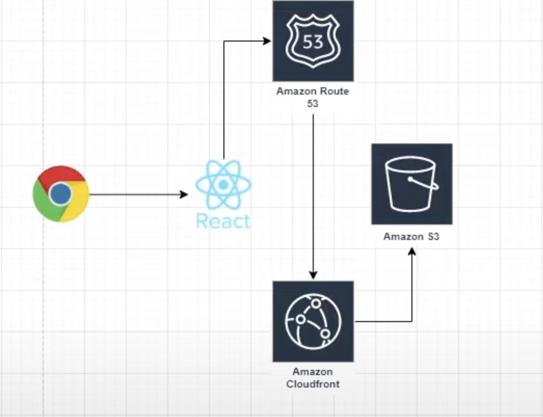

# Flow of execution
1. Bootstrap a `create-react-app` project.
2. Created a new repository on github & pushed the code there.
3. Created a free account on AWS.
4. Deployed the app on S3 (config to be done for routes).
5. Added a Cloudfront Distribution for the S3 bucket.
6. Created code pipeline step, triggered on code change of `release` branch.
7. Created code build step, generates the react build artifact.
8. Created code deploy step, took the artifact from previous step & deploys it to s3/cloudfront.
9. Connected domain to cloudfront distribution.
10. Attached SSL certificate to enable https on cloudfront distribution.
11. Created SNS notifications (to email) for code pipeline stages, (started/succeded/failed) on tanmay@octoapp.ai, mithilesh@octoapp.ai & happynehra777@gmail.com

### Domains connected to cloudfront distribution with SSL certificate link.
[www.happynehra.com](www.happynehra.com)  
[happynehra.com](happynehra.com)  

### S3 bucket link
[http://www.happynehra.com.s3-website.ap-south-1.amazonaws.com](http://www.happynehra.com.s3-website.ap-south-1.amazonaws.com)

### Cloudfront Dristribution link
[https://d1tgk0v6gzwr9y.cloudfront.net](https://d1tgk0v6gzwr9y.cloudfront.net)

### Two routes configured in S3 bucket.
1. www.happynehra.com
2. happynehra.com

## Problems fixed in this project 
1. Build and test for every commit.
2. Automated process.
3. Notify for every build status.
4. Fix code if bugs or error found instantly rathen than waiting.

## Benefits 
1. Agile.
2. No Ops.
3. No human intervention.
4. short MTTR.
5. Fault isolation.

